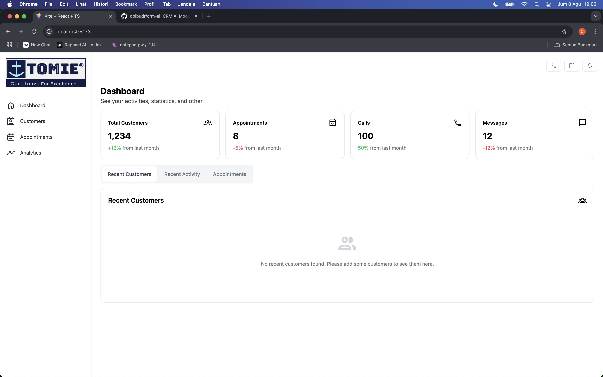
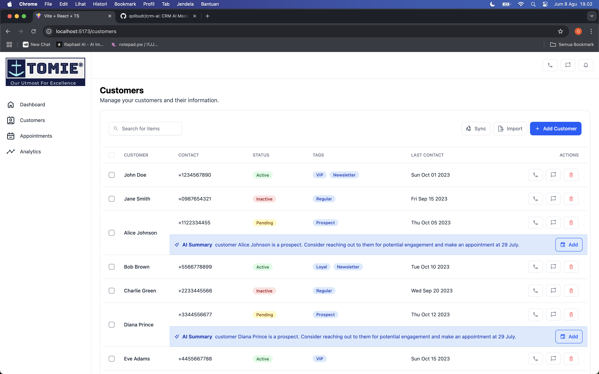
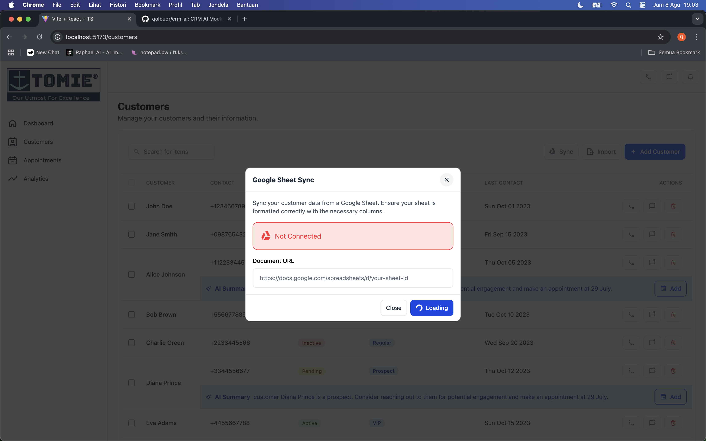
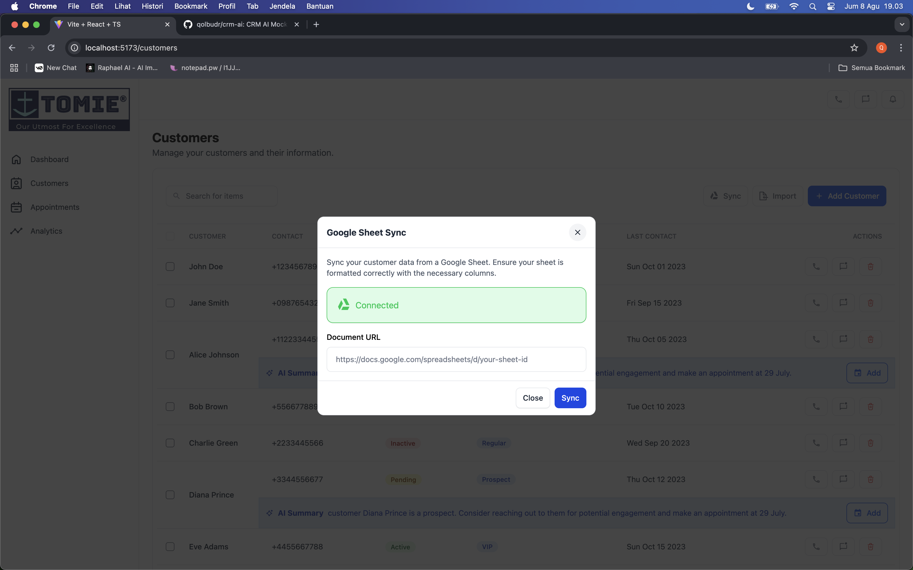
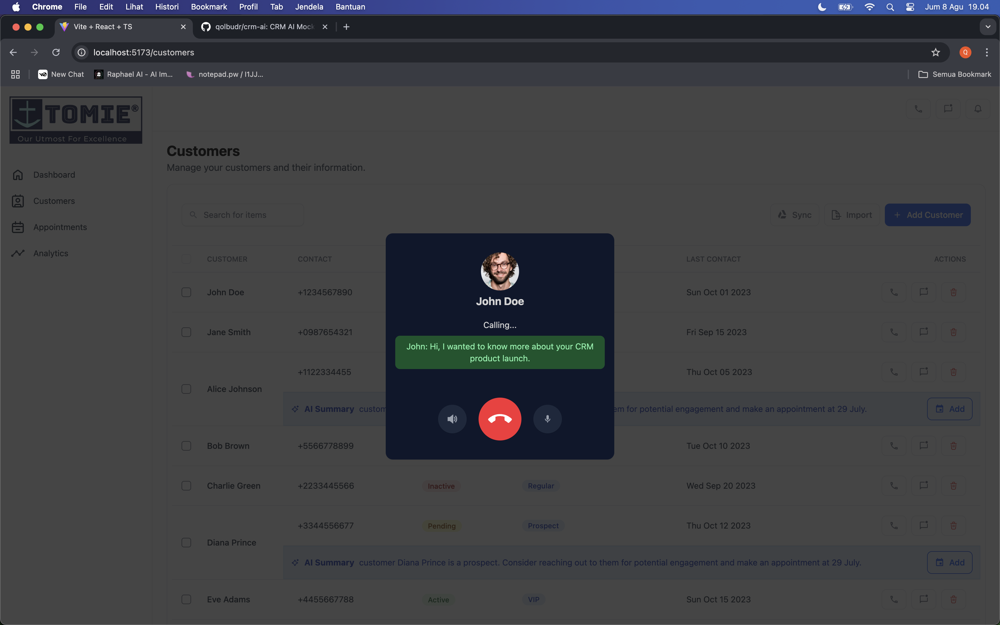
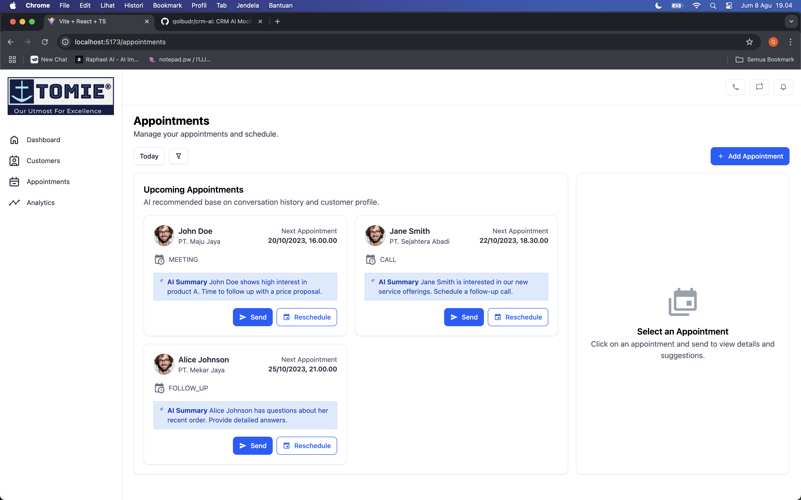
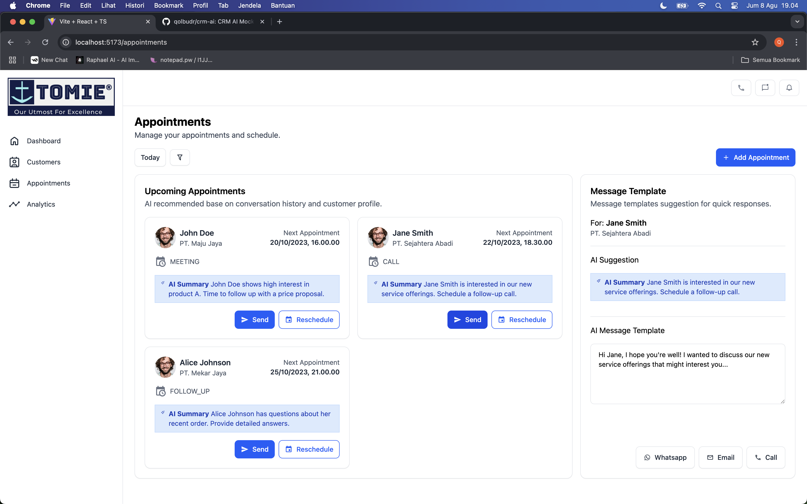
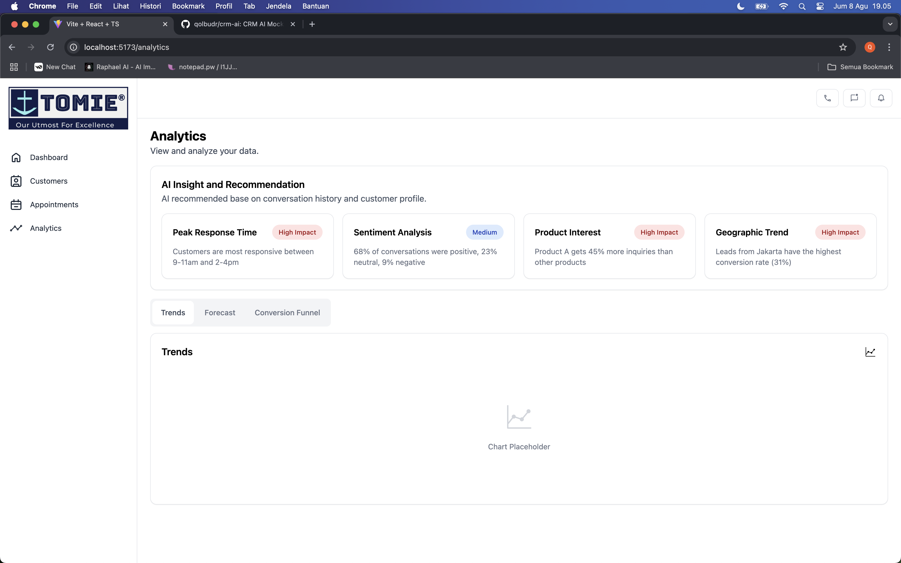

<h2>CRM - AI</h2>
Integerate AI with CRM analytics function

<h2>Features</h2>
<ol>
  <li>In App Call and Transcribe</li>
  <li>Customer list integerated with google sheet</li>
  <li>AI Summary and auto make appointment suggestion base on call conversation</li>
  <li>Appointment schedule</li>
  <li>AI message template recommendation</li>
  <li>Analytics</li>
</ol>

<h2>Screenshot</h2>

  
  
  
  
  
  
  
  

<h2>Installation</h2>
<pre>
  npm install && npm run dev
</pre>